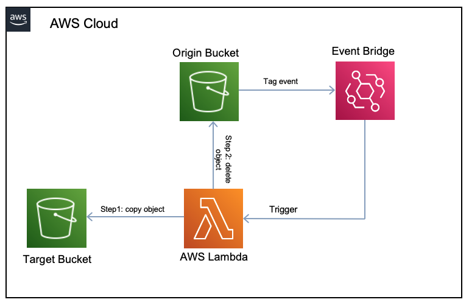
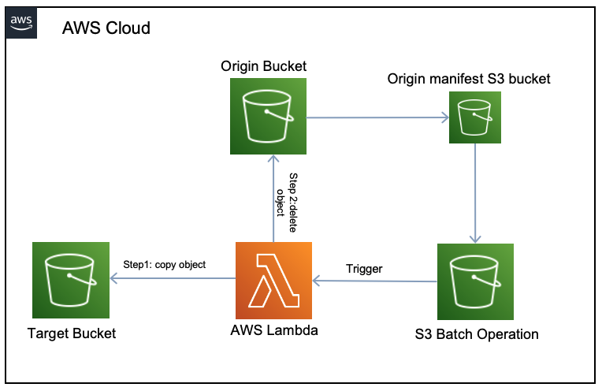

# Move AWS S3 Tagged object

These Lambda functions facilitate the transfer of tagged objects between buckets. If you ever require an automated solution to detect when an object is tagged and subsequently perform a move operation (copying it and then deleting the original), these Lambda functions are designed to handle that task efficiently.

## Requirements
- python >= 3.7
- boto3 >= 1.20.24
- Writing permissions in the target bucket
- Read permissions in the origin bucket

## A bit of history and explanation

I was assigned a mission (Jira ticket) to develop a method for safely removing tagged objects, such as those labeled with the tag `LifeCycle=Delete`, from a critical S3 bucket. The objective is to transfer these objects to a secondary bucket, where they will be retained for a specified period as a precautionary measure in case restoration is needed. At first glance, this task may not seem too complex; however, the challenge arises from the fact that this bucket contains millions of critical objects, and there are no lifecycle rules that can address the situation.

To tackle this issue, I designed two Lambda functions to handle the task in two different scenarios.

### [Scenario 1] Triggered by EventBridge

In this scenario the origin bucket (the bucket with the million of objects) will generate notifications everytime an objects gets tagged, [AWS EventBridge](https://aws.amazon.com/eventbridge/) service will listen these events and will trigger the `lambda/triggered_by_event.py` function which then will look for the specified tag and if the objects has it will copy the object to a target bucket (a temporary bucket) to be removed later on with a lifecycle rule.

### [Scenario 2] Triggered by S3 Batch Operation

What about the existing tagged objects? Initially, I attempted to perform a simple list objects operation; however, I quickly realized that this approach has linear time complexity. When dealing with a million objects, this method could take days or even months to complete.

In this case, the idea is to generate and [inventory configuration](https://docs.aws.amazon.com/AmazonS3/latest/userguide/storage-inventory.html) of all the objects in the buskets that will serve as input of an [S3 Batch Operation](https://docs.aws.amazon.com/AmazonS3/latest/userguide/batch-ops.html). This Batch job will execute `lambda/triggered_by_s3batch.py` function on every object in the inventory previously generated to determine if the tag exist and if it does will proceed to move the object like in the previous scenario.

Hope you find this project useful.
